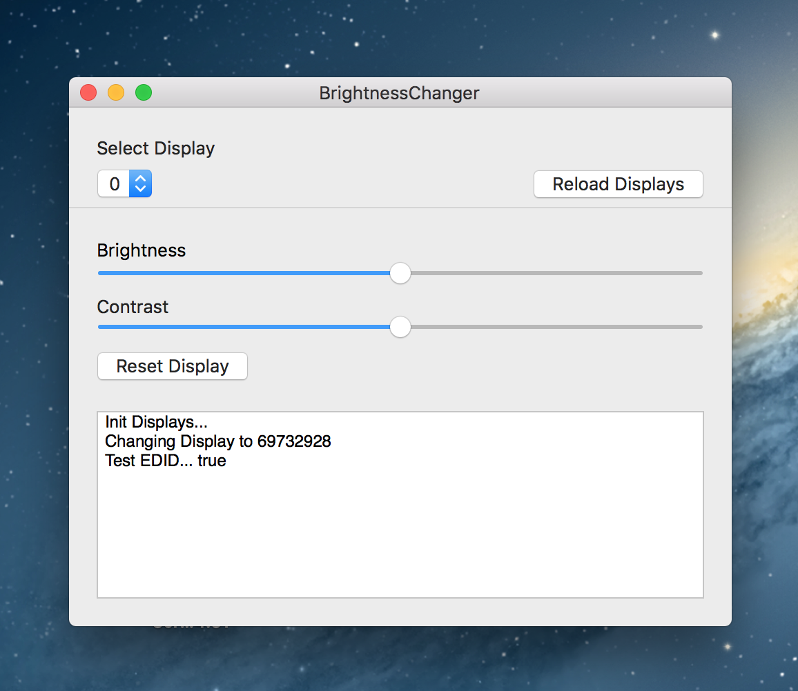

# BrightnessChanger
An utility program to change the brightness and contrast of external display via the [DDC-Protocol](https://de.wikipedia.org/wiki/Display_Data_Channel).

The protocol implementation was adapted from https://github.com/kfix/ddcctl, there are also more information about problems and caveats.

This project started mostly to try out Swift and see how well C-bindings work with it(pretty good!), it is by no means finished or well-tested, but
it won't do more harm than that it might freeze your display.

The Project is still called `CTest` because of the fact, that the bridging-header is currently really buggy and won't work anymore if I rename the folders.

# Install
Just download the binary here: https://github.com/TN1ck/BrightnessChanger/blob/master/BrightnessChanger.zip?raw=true
